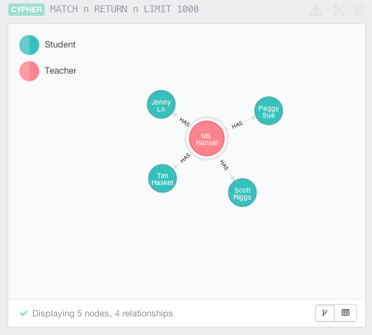

# QCypher

A [q/promise-based](http://documentup.com/kriskowal/q) pure JS library for working with [Neo4j](http://www.neo4j.org)

QCypher uses the Neo4j REST endpoints to issue HTTP requests to the graph database.  Asynchronous queries return Q promises in order to support query chaining.

The library itself aims to be the thinnest possible layer between NodeJS and Neo4j, while allowing that interface to remain dead simple. For more involved usages, QCypher has a set of transaction query functions.  Use those functions when more than simple chaining is required.

## Install via NPM
QCypher may be installed via NPM.

    $ npm install qcypher

[](https://npmjs.org/package/qcypher)

## Using QCypher

Using QCypher consists of requiring the module, initializing the module with the path to the graph database and issuing one or more query calls.
When querying a local database the qcypher.init() call is optional, but using it is good form.

Queries are written in the [Cypher query language](http://www.neo4j.org/learn/cypher) to interact with the graph.

```javascript
  var qcypher = require('qcypher')
    , q = require('q');

  qcypher.init('http://localhost:7474');
  qcypher.query("CREATE (s:Student {name:{student}.name, grade:{student}.grade}) RETURN s", {
    student: {
      name: "Scott Riggs",
      grade: 12
    }
  });
```

To retrieve data from the graph:

```javascript
  qcypher.query("MATCH (s:Student {name:{student}.name}) RETURN s", {
    student: {
      name: "Scott Riggs"
    }
  })
    .then(function(result) {
      var student = result.data[0][0].data;
      console.log('student', student);
    })
```

NOTE: QCypher uses Cypher query parameters.  For more information see:  [Neo4j Cypher Parameters](http://docs.neo4j.org/chunked/stable/cypher-parameters.html)



### Handling query errors
The following query is syntactically invalid and will cause Neo4j to return an error containing an exception and stack trace. This is valuable in helping you determine the cause of your error.

```javascript
  qcypher.query('MERGE (n:QCypher name: "first") RETURN n', {})
    .then(function(result) {
      expect(false).toBeTrue(); // this should not happen
      done();
    })
    .catch(function(error) {
      expect(error.exception).toBeDefined();
      done();
    });
```

When qCypher detects a Neo4j error is rejects its promise allowing you to capture the results in a catch clause as shown above.

If you console log the error using `console.log('error', JSON.stringify(error));`  

Here we see clues to the cause of the problem. Note, that the information returned in the `message` is the same returned in the Cypher web browser console.

```
{
  "message": "Invalid input 'n': expected whitespace, comment, NodeLabel, MapLiteral, a parameter, ')' or a relationship pattern (line 1, column 18)\n\"MERGE (n:QCypher name: \"first\") RETURN n\"\n                  ^",
  "exception": "SyntaxException",
  "fullname": "org.neo4j.cypher.SyntaxException",
  "stacktrace": [
    "org.neo4j.cypher.internal.compiler.v2_1.parser.CypherParser$$anonfun$parse$1.apply(CypherParser.scala:58)",
    "org.neo4j.cypher.internal.compiler.v2_1.parser.CypherParser$$anonfun$parse$1.apply(CypherParser.scala:48)",
    "scala.collection.TraversableLike$$anonfun$map$1.apply(TraversableLike.scala:244)",
    "scala.collection.TraversableLike$$anonfun$map$1.apply(TraversableLike.scala:244)",
    "scala.collection.immutable.List.foreach(List.scala:318)",
    "scala.collection.TraversableLike$class.map(TraversableLike.scala:244)",
    "scala.collection.AbstractTraversable.map(Traversable.scala:105)",
    "org.neo4j.cypher.internal.compiler.v2_1.parser.CypherParser.parse(CypherParser.scala:47)",
    "org.neo4j.cypher.internal.compiler.v2_1.CypherCompiler.isPeriodicCommit(CypherCompiler.scala:133)",
    "org.neo4j.cypher.internal.CypherCompiler.isPeriodicCommit(CypherCompiler.scala:91)",
    "org.neo4j.cypher.internal.ServerExecutionEngine.isPeriodicCommit(ServerExecutionEngine.scala:34)",
    "org.neo4j.cypher.javacompat.internal.ServerExecutionEngine.isPeriodicCommitQuery(ServerExecutionEngine.java:56)",
    "org.neo4j.server.rest.web.CypherService.cypher(CypherService.java:99)",
    "java.lang.reflect.Method.invoke(Method.java:606)",
    "org.neo4j.server.rest.transactional.TransactionalRequestDispatcher.dispatch(TransactionalRequestDispatcher.java:139)",
    "java.lang.Thread.run(Thread.java:744)"
  ]
}
```

View the jasmine-node tests for other examples.

## Working with Transactions

For more complex queries and usecases, QCypher supports transactions.

Neo4j transaction support is outlined here: http://docs.neo4j.org/chunked/stable/rest-api-transactional.html 

## Batch operations

QCypher does NOT support batch operations as defined here: http://docs.neo4j.org/chunked/stable/rest-api-batch-ops.html

## Tests
QCypher has a suite of tests in the `/spec` folder. In order to run the tests neo4j must be running and jasmine-node must be installed.

The test suite requires jasmine-node to be installed globally. If you don't have it installed run:

    $ npm install -g jasmine-node
    
Run the tests using:
`Warning`: these tests will flush your local database!

    $ npm test

